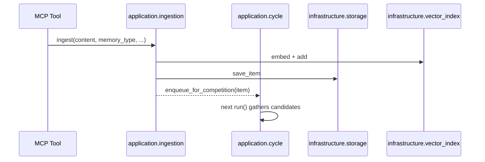
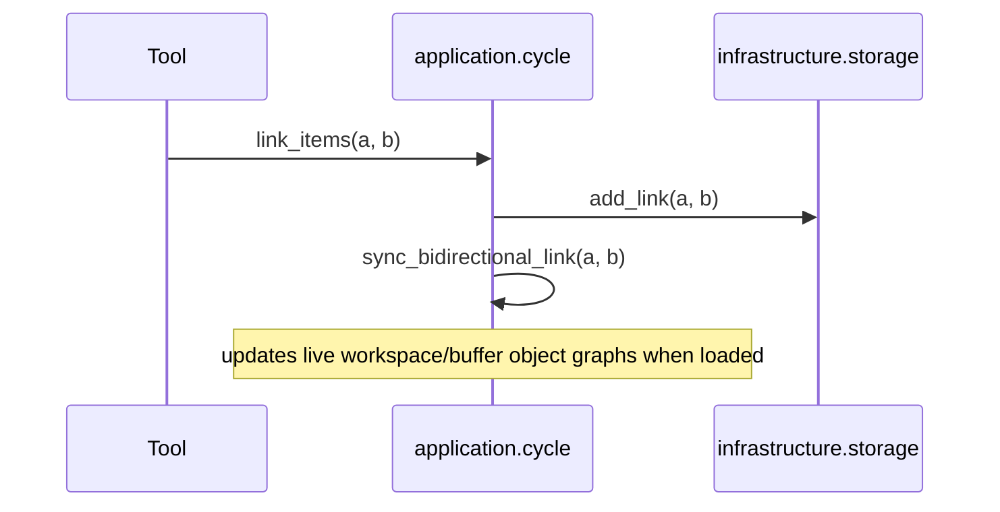
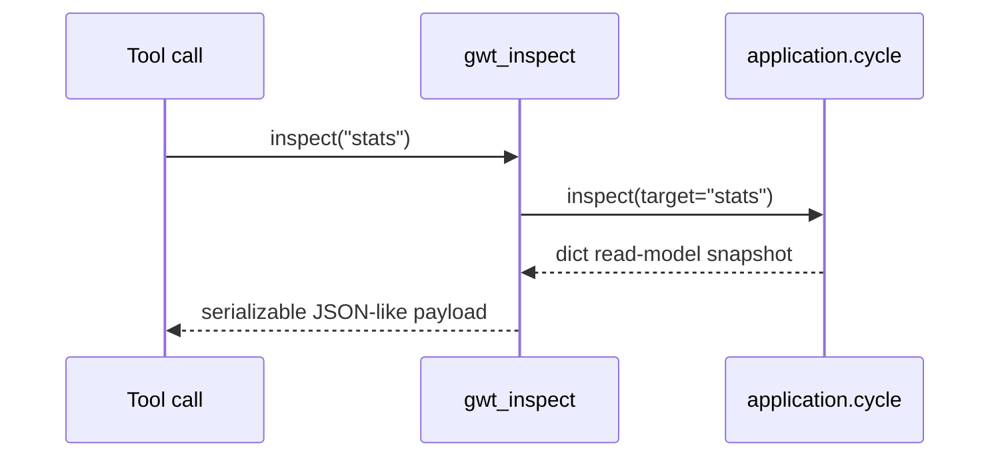

# Architecture and Boundaries (Target + Current Delta)

## 1) Purpose

This document is the target clean-architecture contract for `gwt-context` and the minimum change set needed for upcoming P5/P6 refactors. Current behavior remains runtime-compatible while moving toward strict layer boundaries.

## 2) Module map (current repo)

```text
src/gwt_context/
├── domain/                # pure business rules and entities (no I/O)
│   ├── models.py
│   ├── workspace.py
│   ├── competition.py
│   ├── specialists.py
│   └── broadcast.py
├── application/           # orchestration and service workflows
│   ├── cycle.py
│   ├── ingestion.py
│   └── goal_manager.py
├── infrastructure/        # concrete adapters for storage/vector/embeddings
│   ├── config.py
│   ├── embeddings.py
│   ├── storage.py
│   └── vector_index.py
├── interfaces/            # boundary contracts (ports)
│   └── ports.py
├── mcp/                  # transport protocol (tools/resources/prompts)
│   ├── tools.py
│   ├── resources.py
│   └── prompts.py
├── server.py              # composition root / bootstrap
└── __main__.py            # entrypoint delegating to server main()
```

## 3) One-way dependency rules (normative)

- `domain` MUST NOT depend on `application`, `infrastructure`, `mcp`, or `server`.
- `application` MAY depend on `domain` and MUST depend on `interfaces` for external capabilities.
- `infrastructure` MAY depend on `domain` and MAY implement `interfaces`.
- `mcp` MAY depend on `application` services and/or `interfaces`, NOT on concrete `infrastructure`.
- `server` MAY depend on all layers for composition and object wiring only.

### Forbidden imports (hard checks)

- `application/*` importing `infrastructure/*` concrete classes
- `mcp/*` importing `infrastructure/*` concrete classes
- `domain/*` importing `application/*` or `infrastructure/*`
- direct mutation of MCP-facing state from domain models

## 4) Required ports in target

| Port | Intent | Owner | Current implementation |
| --- | --- | --- | --- |
| `EmbeddingPort` | embed text + dimensions | `infrastructure/embeddings.py` | Used by `GoalManager`/`IngestionPipeline` via interface contracts. |
| `GoalManagerPort` | goal activation/selection API | `application/goal_manager.py` | Used by `SelectionBroadcastCycle` via interface contracts. |
| `VectorSearchPort` | add/query/save/remove vector state | `infrastructure/vector_index.py` | Used by `IngestionPipeline`/`SelectionBroadcastCycle` via interface contracts. |
| `MemoryRepositoryPort` | persistence for memory/goals/broadcasts + links | `infrastructure/storage.py` | Used by `GoalManager`/`IngestionPipeline`/`SelectionBroadcastCycle` via interface contracts. |
| `IngestionPort` | `ingest`, `query_similar` | `application/ingestion.py` | Exposed to MCP tools. |
| `CyclePort` | `run`, `run_competition_dry`, `enqueue_for_competition`, `set_goal`, `inspect`, `evict_workspace_item`, `link_items` | `application/cycle.py` | Implemented and called by MCP tools. |

## 5) Composition root responsibilities

- `server.py` is the single composition root.
- `__main__.py` only invokes `server.main()`.
- `server.py` owns:
  - loading config (`GWTConfig`)
  - concrete infra construction (`SQLiteMemoryStore`, `VectorIndex`, `SentenceTransformerEmbedder`)
  - constructing domain and application services
  - state restore on startup (`_restore_state`)
  - MCP registration
- `server.py` must not contain scoring/ranking policy or orchestration semantics.

## 6) Import/ownership matrix

### Current

- `server.py`: imports concrete infra and registers MCP against concrete runtime services.
- `application/*`: now depends on interface ports for external collaborators.
- `mcp/tools.py`: now typed against `CyclePort`/`IngestionPort`.
- `mcp/resources.py`: still uses cycle-derived in-memory views and repository reads for resource payloads.

### Target after P5/P6

- `application/*` depends only on `interfaces` ports + `domain`.
- `mcp/*` depends only on `application` services/ports.
- `server.py` remains the only place with concrete adapter creation.

## 7) `SelectionBroadcastCycle` boundary-facing behavior

The following cycle behaviors are the current application API contract used by MCP:

- `run()`
- `run_competition_dry(n_slots: int | None)`
- `enqueue_for_competition(item)`
- `set_goal(description, keywords, priority)`
- `evict_workspace_item(item_id)`
- `link_items(source_id, target_id)`
- `inspect(target="workspace|buffer|goals|stats")`

## 8) Critical flow sequences (current + target)

### 8.1 Ingest + candidacy



### 8.2 Link update and in-session consistency



### 8.3 Tool inspect path



## 9) Migration state / blocked items

- **P5 blocked items**
  - `application/cycle.py`, `application/ingestion.py`, `application/goal_manager.py` still use concrete infra classes in constructors and internals.
  - Adapters should be passed in as ports from `interfaces/ports.py`.

- **P6 partially blocked**
  - `mcp/tools.py` is port-oriented.
  - `mcp/resources.py` still inspects cycle state shape (`workspace`, `buffer`, `goal_manager`) and repository read models to render resources.
  - This is acceptable in target-gap status while P6 replaces it with explicit read-model services.

- **Enforcement plan**
  - Before each P5/P6 PR:
    - no forbidden imports (section 3)
    - all composition happens in `server.py`
    - MCP handlers call only declared port methods
    - tests include delegation checks for MCP boundary

## 10) ADR index

### ADR-1: Port-first dependency strategy
- Date: 2026-04-19
- Decision: introduce and use `interfaces/ports.py` for application and MCP boundaries.
- Rationale: decouple orchestration from adapter classes.
- Consequence: constructor signatures must migrate to protocols.

### ADR-2: Composition root ownership
- Date: 2026-04-19
- Decision: only `server.py` composes concrete implementations.
- Rationale: deterministic startup and easier testing via fake ports.
- Consequence: all ad-hoc instantiation outside composition root is technical debt.

### ADR-3: Storage/search/vector boundary separation
- Date: 2026-04-19
- Decision: keep infrastructure ownership of persistence/vector/embedding implementation.
- Rationale: adapter-based exchangeability.
- Consequence: implementations may change without touching domain/application behavior.

### ADR-4: MCP boundary contract first
- Date: 2026-04-19
- Decision: MCP tools/resources expose application intent via `CyclePort`/`IngestionPort`.
- Rationale: transport remains stable and testable.
- Consequence: direct dependency on concrete internals is not a long-term state and must be migrated under P6.
